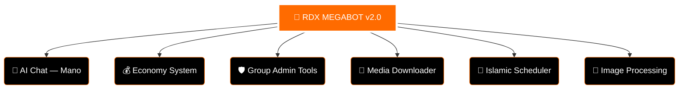

<div align="center">

<!-- ANIMATED HEADER WAVE -->


<!-- LOGO -->


<br>

<!-- DYNAMIC TYPING SVG -->


<br>

<!-- ANIMATED DIVIDER -->


<br>

<!-- GIF 1 — OVERVIEW SECTION -->


<br><br>

<!-- STATUS BADGES -->
<p>
  
  
  
</p>

<p>
  
  
  
  
</p>

<!-- VISITOR COUNTER -->


</div>

---

## 🌟 RDX MEGABOT — OVERVIEW

**RDX MEGABOT v2.0** is the most advanced Facebook Messenger automation bot. Built for power, speed, and intelligence — with 134+ commands, AI chat, group management, economy system, and much more.

<div align="center">

<!-- GIF 2 — FEATURES HIGHLIGHT -->


</div>

<br>

### 🏗️ SYSTEM ARCHITECTURE



---

## 🤖 AI SYSTEM

<div align="center">

<!-- GIF 3 — AI SECTION -->


<br>


</div>

| 🤖 AI Feature | Description |
|:---|:---|
| **Model** | Google Gemini 2.5 Flash + Cerebras llama-3.1-8b |
| **Personality** | Mano — Friendly Roman Urdu AI |
| **Context Memory** | Last 4 messages per thread |
| **Owner Mode** | Special VIP replies for bot owner |
| **Trigger** | Name mention OR reply to bot |

---

## 🛡️ ADMIN & GROUP TOOLS

<div align="center">

<!-- GIF 4 — ADMIN SECTION -->


</div>

<br>

<table width="100%">
<tr>
<td width="50%" valign="top">

```
👥 Group Management
─────────────────────
✅ Kick / Add Members
✅ Ban / Unban Users
✅ Anti-Out Protection
✅ Only Admin Mode
✅ Approve-Only Mode
✅ Nick Lock / Unlock All
✅ Set Group Name/Image
✅ Set Group Emoji/Theme
✅ Thread Ban System
✅ Poll Creator
```

</td>
<td width="50%" valign="top">

```
🔧 Bot Admin Tools
─────────────────────
✅ Reload Commands
✅ Refresh Bot
✅ Restart Bot
✅ Enable / Disable Commands
✅ Broadcast to All Groups
✅ Bot Notification System
✅ Spam GC Protection
✅ Edit Messages
✅ Unsend Messages
✅ Resend System
```

</td>
</tr>
</table>

---

## 💰 ECONOMY SYSTEM

<div align="center">

<!-- GIF 5 — ECONOMY SECTION -->


<br>


</div>

<br>

| 💰 Economy Feature | Description |
|:---|:---|
| **Balance** | Check your wallet balance |
| **Bank** | Deposit & manage funds |
| **Daily** | Claim daily reward coins |
| **Rank Up** | Level up with XP system |
| **Top** | Leaderboard of richest users |
| **Transfer** | Send coins to friends |
| **Open Account** | Create new economy account |

---

## 🎵 MEDIA & DOWNLOADER

<div align="center">

<!-- GIF 6 — MEDIA SECTION -->


</div>

<br>

<table width="100%">
<tr>
<td width="50%" valign="top">

```
🎵 Audio & Video
─────────────────────
✅ YouTube MP3 Download
✅ Play Music in Chat
✅ Play Video in Chat
✅ Text to Video
✅ Emoji GIF Sender
```

</td>
<td width="50%" valign="top">

```
📱 Auto Downloaders
─────────────────────
✅ Auto TikTok Video
✅ Auto Instagram Reel
✅ Auto Facebook Video
✅ Auto YouTube Clip
✅ IBB Image Uploader
```

</td>
</tr>
</table>

---

## 🎨 IMAGE TOOLS & FUN

<div align="center">

<!-- GIF 7 — IMAGE / FUN SECTION -->


</div>

<br>

```
🎨 Image Processing          🎉 Fun Commands
──────────────────────────   ──────────────────────────
✅ Remove Background         ✅ Pair / Bestie / Sister
✅ Image Filters             ✅ Hack Animation
✅ Image Enhance             ✅ Slap / Kiss
✅ Set Profile Picture       ✅ Send Food GIFs
✅ Avatar Generator          ✅ Info Cards
✅ Translate Messages        ✅ Friendship System
```

---

## 🌙 SPECIAL & ISLAMIC FEATURES

<div align="center">

<!-- GIF 8 — ISLAMIC / SPECIAL SECTION -->


<br>


</div>

---

## 🚀 DEPLOYMENT CENTER

<div align="center">

<!-- GIF 9 — DEPLOYMENT SECTION -->


<br>


<br>

[](https://bot-hosting.net/)
&nbsp;
[](https://render.com/)
&nbsp;
[](../../fork)
&nbsp;
[](../../stargazers)

</div>

<br>

### 🛠️ Step 1 — Clone the Repository
```bash
git clone https://github.com/YOUR_USERNAME/rdx-megabot.git
cd rdx-megabot
```

### 🛠️ Step 2 — Install Dependencies
```bash
npm install
```

### 🛠️ Step 3 — Add Facebook Cookies
> Place your Facebook session in `bot_connect/cookies.txt`

### 🛠️ Step 4 — Configure Bot
Edit `config.json`:
```json
{
  "PREFIX": ".",
  "BOTNAME": "🌟 RDX MEGABOT 🌟",
  "ADMINBOT": ["YOUR_FACEBOOK_UID"],
  "TIMEZONE": "Asia/Karachi"
}
```

### 🛠️ Step 5 — Start the Bot
```bash
npm start
```

---

## ⚙️ 24/7 GITHUB ACTIONS

Paste this into `.github/workflows/npn-publish.yml`:

```yaml
name: Run Bot - RDX-BOT

on:
  push:
    branches:
      - main

jobs:
  run-bot:
    runs-on: ubuntu-latest

    steps:
      - name: Checkout code
        uses: actions/checkout@v3

      - name: Setup Node.js
        uses: actions/setup-node@v3
        with:
          node-version: '20'

      - name: Install dependencies
        run: npm install

      - name: Run the bot
        run: node index.js
```

---

## 🎬 VIDEO TUTORIAL

<div align="center">


<br>

[](https://youtu.be/YulhBcoBCrg?is=-iboAppXB4hScoxn)
&nbsp;&nbsp;
[](https://youtu.be/qD0YVCc_rA0?is=qivysVNH08atadWI)

</div>

---

## 👑 THE CREATOR — SARDAR RDX

<div align="center">

<!-- GIF 10 — CREATOR SECTION (CIRCULAR) -->


<br>

<!-- CAPSULE RENDER CREATOR NAME -->


<br>

<!-- SOCIAL LINKS WITH ANIMATED ICONS -->
<p align="center">
  <a href="https://wa.me/qr/Q65AI7L4ZOBFO1">
    
  </a>
  &nbsp;&nbsp;&nbsp;
  <a href="https://youtube.com/@rdx-bot-zone?si=mqXyWwBKnkStiVxV">
    
  </a>
  &nbsp;&nbsp;&nbsp;
  <a href="https://whatsapp.com/channel/0029VbCU9yi4tRroe2Xhwl24">
    
  </a>
</p>

<br>

[](https://wa.me/qr/Q65AI7L4ZOBFO1)
&nbsp;
[](https://whatsapp.com/channel/0029VbCU9yi4tRroe2Xhwl24)
&nbsp;
[](https://youtube.com/@rdx-bot-zone?si=mqXyWwBKnkStiVxV)

<br>

<!-- SIGNATURE TYPING -->


<br>

<!-- RAINBOW ANIMATED DIVIDER -->


<p>
  🚀 <b>RDX MEGABOT v2.0</b> &nbsp;|&nbsp; Developed by <b>SARDAR RDX</b> &nbsp;|&nbsp; © 2026 &nbsp;|&nbsp; WA: +923301068874
</p>

<!-- FOOTER WAVE -->


</div>
